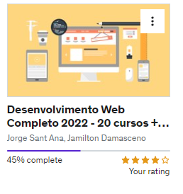

  

  
  

 Desenvolvimento Web Completo 2022 - 20 cursos + 20 projetos
Authors: <a href="https://jamiltondamasceno.com.br/">Jamilton Damasceno</a> e <a href="https://jorgesantana.net.br/">Jorge Sant Ana</a>
 
 

<h1>Technologies that I've Learned</h1>

  
  
   
   
  
  
  
   
  
  
   
  
    
  
  
  
   
    
  
  
      
  
  
  
  
  

<h1> Course Program</h1>

Criar aplicações WEB: Do front ao back-end e banco de dados com HTML5, CSS3, BootStrap 4, JS, ES6, ES7, PHP 7, OO, MySQL, JQuery, MVC, API, IONIC e Wordpress.
Integrar as principais tecnologias Web através de projetos reais. Tudo na prática!
Como tornar suas habilidades em desenvolvimento web uma atividade remunerada, trabalhando de onde quiser.
Criar aplicações Mobile conectadas a aplicações WEB utilizando a tecnologia IONIC.

<ul>
  <li> [x]   Cabeçalhos, listas, imagens, links, tabelas, formulários, hear, nav, footer, article, section aside.</li>
  <li> [x]   Seletores, div & span, cores, modelo caixa, elementos flutuantes, posicionamento, formatando links.</li>
  <li> [x]   Herança, especifidade, barra navegação vertical e horizontal, abas, layouts líquidos, largura fixa, parallax, fontes customizadas.</li>
  <li> [x]   Normalize css, cantos arredondados, degradês, sombras, animações, transições, flexbox.</li>
  <li> [x]   Responsivo, textos, alinhamentos, cores, media query, botões, barra navegação, listas, inputs, alertas, tabelas, cards, grids, flexbox.</li>
  <li> [x]   Variáveis, array, condicionais, operadores de comparação, operadores lógicos, funções, eventos, DOM, loops, BOM.</li>  
  <li> [ ]   Var e let, orientação a objetos, literais, prototype, web storage, funções de array. And ECMA Script, 2016, 2017, 2018, 2019, 2020 e 2021</li>
  <li> [ ]    Variáveis, arrays, condicionais, operadores de comparação e lógicos, funções, orientação a objetos, abstração, herança, polimorfismo, interfaces.</li>
  <li> [ ]    Insert, update, select, delete, filtros, operadores de comparação e lógicos, relacionamentos, inner join, left join, right join.</li>
  <li> [ ]    requisições síncronas, requisições assíncronas, XMLHttpRequest, estados da requisição, status, notação XML, notação JSON.</li>
  <li> [ ]    Conexão com banco, executando instruções SQL, fetch, fetch all, foreach, SQL injection.</li>
  <li> [ ]    DNS, hospedagem, cPainel, FTP, configuração do PHP e MySQL.</li>
  <li> [ ]    Selecionando e manipulando elementos HTML, navegando entre elementos, manipulando CSS, eventos de teclado, mouse e formulário, animações, ajax..</li>
  <li> [ ]    Composer, controlador, rota, modelo, visão, abstração, reutilizando layout, conexão com banco de dados.</li>
  <li> [ ]    Registro e autenticação de usuários, criando timeline, pesquisando usuários, exibindo tweets, seguindo e deixando de seguir, paginação.</li>
  <li> [ ]    Requisições, rotas, dependências, middleware, respostas, banco de dados, criando API.</li>
  <li> [ ]    Alinhamento, variáveis, interpolação, for, while, each, funções, mixin, herança, diretivas de controle.</li>
  <li> [ ]    Componentes, botões, entrada de dados, data biding, angular, grids, navegação e modelo.</li>
  <li> [ ]    Instalação, temas, personalização, plugins, usuários, comentários, criador de páginas com elementor.</li>

